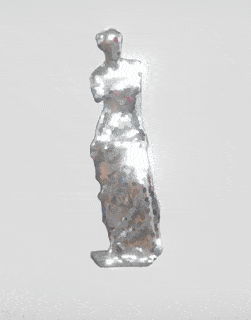

# Venus De Disco

Venus De Disco is an experimental AR art installation built in Meta Spark Studio.

It is accessible via Instagram and Facebook as an augmented reality effect for posts, stories, and video chats.

## License
This project is free to use and modify.

[La Venus De Disco](https://sketchfab.com/3d-models/la-venus-de-disco-d9ce7035f30b48f79ee5d400bdc2f14e) model by David Gallardo and [Disco Ball](https://sketchfab.com/3d-models/disco-ball-e4c3b485680843c7a7a827d04ac28743) model by araghon007 acquired from SketchFab.